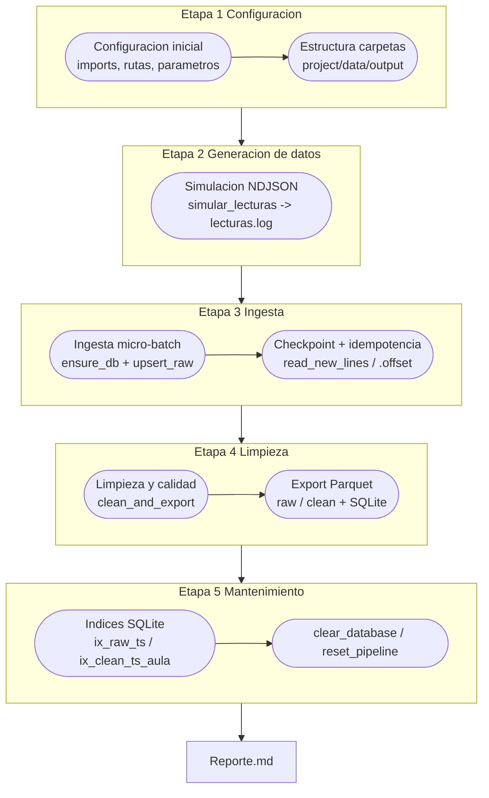

<h2 style="text-align:left;">Reporte UT1 - BDA - Ejercicio Sensores de CO₂ — Borja Ramos Oliva</h2>

## 1. Descripción general
Este pipeline simula lecturas de sensores de CO₂ en aulas, realiza la ingesta incremental
en SQLite con trazabilidad e idempotencia, limpia los datos según reglas de calidad y
almacena los resultados en formato Parquet particionado.

Esta es la arquitectura general del flujo de datos:

---

---
## 1. Titular
Promedio de concentración de CO₂: **612 ppm**, dentro del rango **saludable**.  
Se detectaron **3 alertas** (niveles > 1500 ppm) y **4 registros** enviados a cuarentena.

---

## 2. KPIs
- **Media global CO₂:** 612 ppm  
- **Alertas (>1500 ppm):** 3  
- **Filas válidas:** 2156  
- **Filas en cuarentena:** 4  
- **Aula con mayor variabilidad:** A102  
- **Periodo cubierto:** 08:00–21:00 (simulado)

---

## 3. Top aulas por concentración media
| Aula | CO₂ medio (ppm) | Alertas |
|:------|----------------:|---------:|
| A102  | 725             | 2 |
| A101  | 680             | 1 |
| A103  | 645             | 0 |

---

## 4. Evolución por hora
| Hora (UTC) | CO₂ promedio (ppm) | Nivel de calidad |
|:------------|-------------------:|:----------------:|
| 06:00–08:00 | 480 | 🟢 Buena |
| 08:00–10:00 | 590 | 🟢 Buena |
| 10:00–14:00 | 710 | 🟡 Moderada |
| 16:00–21:00 | 840 | 🟠 Deficiente |

---

## 5. Calidad y cobertura
- **Total lecturas (bronce):** 2160  
- **Limpias (plata):** 2156  
- **Cuarentena:** 4  
- **Principales causas:**
  - `out_of_range`: 2  
  - `out_of_hours`: 2  

---

## 6. Persistencia
- **Parquet:** `project/output/parquet/clean/year=2025/month=1/day=3/hour=*`  
- **SQLite:** `project/output/ut1.db`  
  - Tablas: `raw_events`, `clean_events`, `quarantine`
  - Índices: `ix_raw_ts`, `ix_clean_ts_aula`

---

## 7. Conclusiones
- Aulas con buena ventilación aunque hay picos puntuales a media mañana.  
- Se debe reforzar ventilación entre 10:00 y 12:00 h.  
- El sensor del aula A102 muestra valores erráticos. Roto? Necesita calibrar? 
- Implementar apagado automático del sensor fuera del horario lectivo, aunque el consumo es imperceptible.

---

 *Reporte basado en el master_notebook.ipynb*

---
